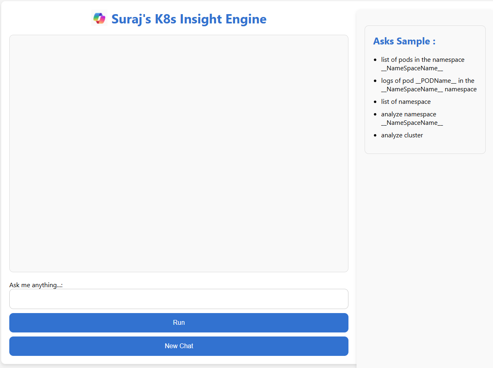

# ![SPICON] Suraj's K8s Insight Engine

Suraj's K8s Insight Engine is a web-based application designed to interact with Kubernetes clusters. It allows users to execute various commands to retrieve information about pods, logs, namespaces, and perform k8sgpt analysis. The application features a modern, user-friendly interface with a chat-like interaction model.

<!-- Centered Image with Specific Size -->
<div align="center">
    
</div>

## Directory Structure

```
k8s-Insight-Engine
├── Dockerfile
├── requirements.txt
├── src
│   ├── modules
│   │   ├── __init__.py
│   │   ├── config.py
│   │   ├── logs.py
│   │   ├── namespaces.py
│   │   ├── analysis.py
│   │   └── pods.py
│   ├── routes
│   │   ├── __init__.py
│   │   ├── pods.py
│   │   ├── logs.py
│   │   ├── namespaces.py
│   │   └── analysis.py
│   └── main.py
└── public
    ├── index.html
    └── icon.png
```

## Getting Started

### Prerequisites

- Docker
- Kubernetes cluster
- Python 3.9

### Installation

1. **Clone the repository:**
   ```bash
   git clone https://github.com/your-username/k8s-Insight-Engine.git
   cd k8s-Insight-Engine
   ```

2. **Build the Docker image:**
   ```bash
   docker build -t k8s-pod-listener .
   ```

3. **Run the Docker container:**
   ```bash
   docker run -d -p 5000:5000 -v ~/.kube/config:/root/.kube/config --name k8s-pod-listener k8s-pod-listener
   ```

4. **Access the web interface:** Open your web browser and navigate to [http://localhost:5000](http://localhost:5000).

## Usage

Enter commands in the input field to interact with your Kubernetes cluster. Example commands include:

- list of pods in the namespace nginx
- logs of pod ingress-nginx-tag-controller-j6ljq in the nginx namespace
- list of namespaces
- analyze namespace nginx
- analyze cluster

## Project Structure

**Dockerfile**  
Defines the Docker image for the application, including the installation of dependencies and k8sgpt.

**requirements.txt**  
Lists the Python dependencies required for the application.

**src**  
The main source directory containing all the application code.

**modules**  
Contains the core functionality modules.

- `config.py`: Handles Kubernetes configuration loading.
- `logs.py`: Contains functions to retrieve pod logs.
- `namespaces.py`: Contains functions to retrieve namespaces.
- `analysis.py`: Contains functions to perform k8sgpt analysis.
- `pods.py`: Contains functions to retrieve pod information.

**routes**  
Contains the route handlers for the Flask application.

- `__init__.py`: Registers the individual route blueprints.
- `pods.py`: Handles routes related to pods.
- `logs.py`: Handles routes related to logs.
- `namespaces.py`: Handles routes related to namespaces.
- `analysis.py`: Handles routes related to k8sgpt analysis.

**main.py**  
Initializes and runs the Flask application, registering the blueprints.

**public**  
Contains static files served by the application.

- `index.html`: The main HTML file for the web interface.
- `icon.png`: The icon displayed in the title.

## Contributing

Contributions are welcome! Please open an issue or submit a pull request.

<!-- Local -->
[K8SIcon]: public/image.png
[SPICON]: public/icon.png
